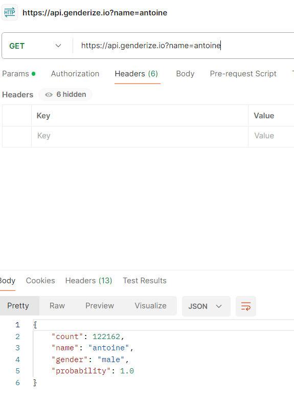
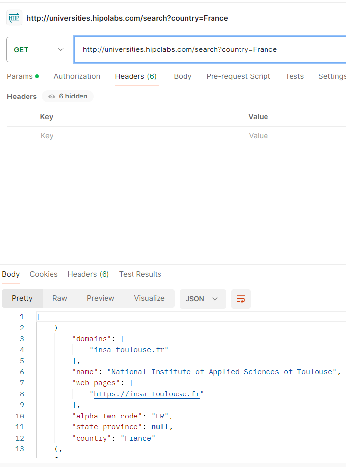
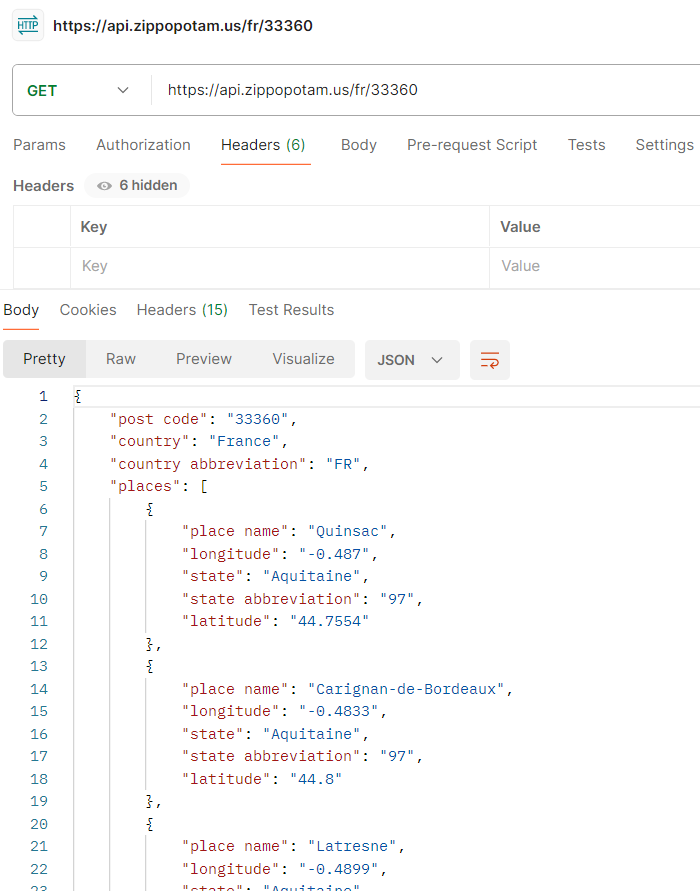
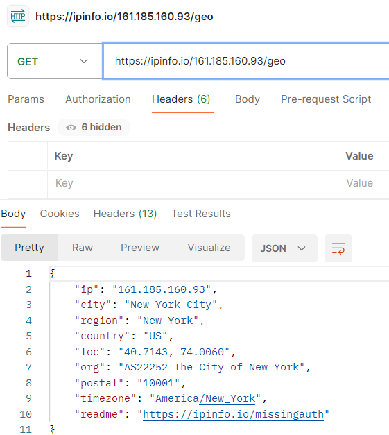

This is the work i did for the final.

First part (using the apis with basic informations) :

1st API : Agify.io

Predict the age of a person based on their name.
https://api.agify.io?name=valentin

2nd API : Genderize.io

Predict the gender of a person based on their name.
https://api.genderize.io?name=antoine

3rd API : 

Universities List

http://universities.hipolabs.com/search?country=France

4th API : 

Zippopotam

Get information about a specified ZIP code.

https://api.zippopotam.us/us/33162

5th API : 

IPinfo

https://ipinfo.io/161.185.160.93/geo

