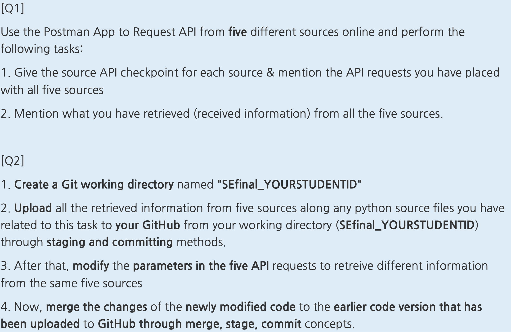

This is the work i did for the final.

First part (using the apis with basic informations) :

1st API : Agify.io

Predict the age of a person based on their name.
https://api.agify.io?name=valentin

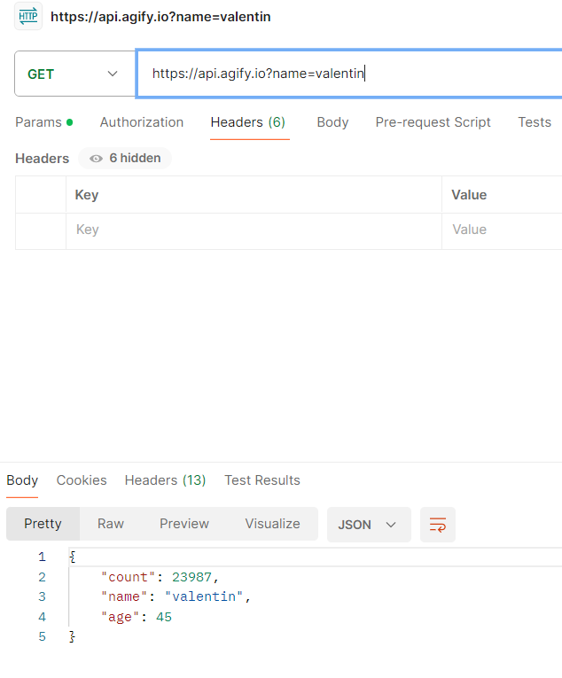

2nd API : Genderize.io

Predict the gender of a person based on their name.
https://api.genderize.io?name=antoine

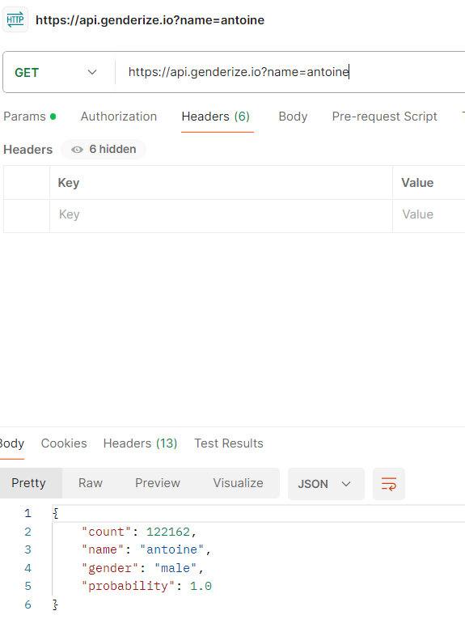

3rd API : Universities List

Get a list of universities in a specified country.
http://universities.hipolabs.com/search?country=France

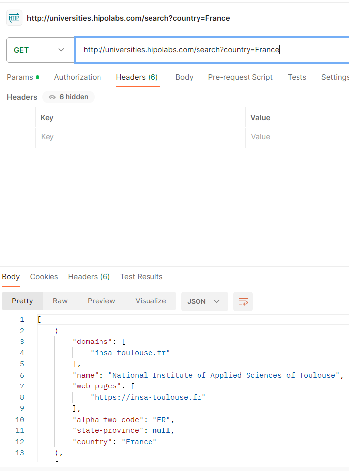

4th API : Zippopotam

Get information about a specified ZIP code.
https://api.zippopotam.us/fr/33360

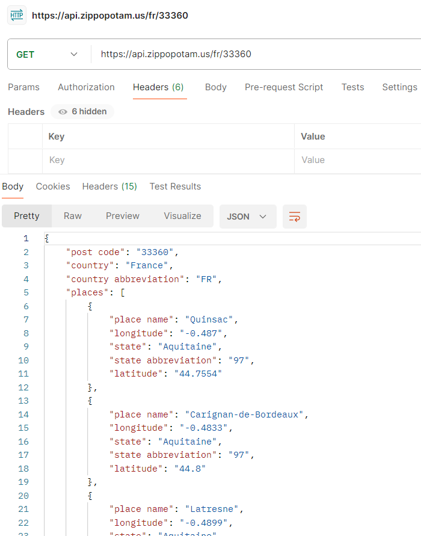

5th API : IPinfo

Get information about a specified IP address, such as geological info, company, and carrier name.
https://ipinfo.io/161.185.160.93/geo

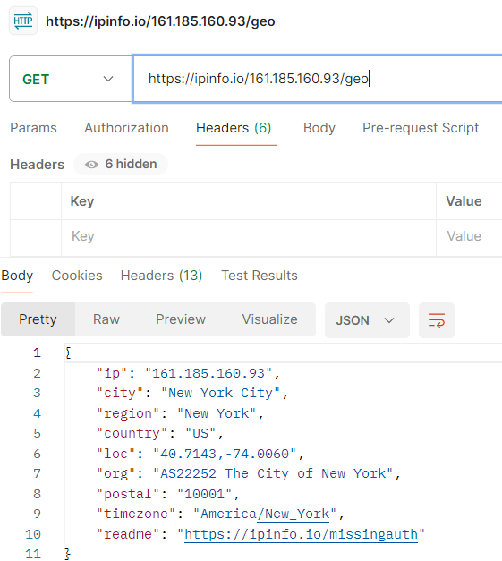

Second part : 

So now i can make some changes to these API calls, to retrieve differents datas. It will be same way of getting datas but different datas in the end

1st API (with different query) : Agify.io

Predict the age of a person based on their name.
https://api.agify.io?name=yannick

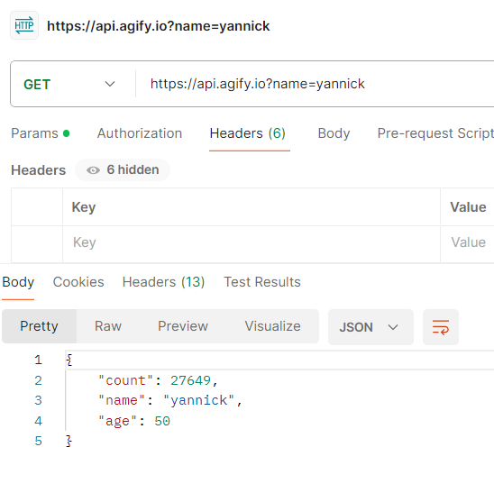

2nd API (with different query) : Genderize.io

Predict the gender of a person based on their name.
https://api.genderize.io?name=lucie

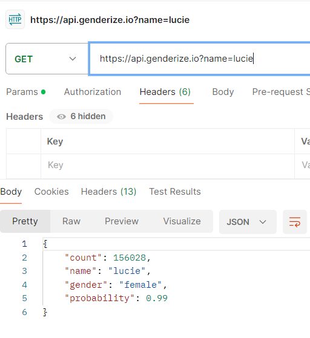

3rd API (with different query) : Universities List

Get a list of universities in a specified country.
http://universities.hipolabs.com/search?country=Spain

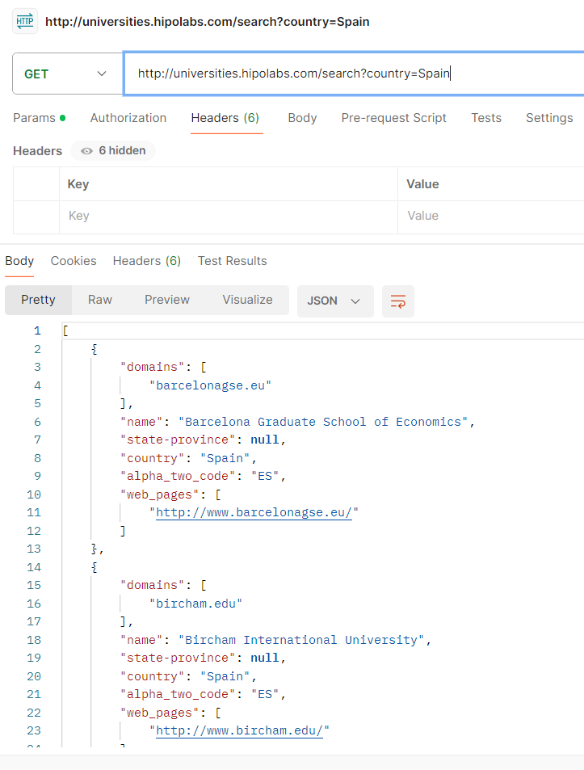

4th API (with different query) : Zippopotam

Get information about a specified ZIP code.
https://api.zippopotam.us/us/33162

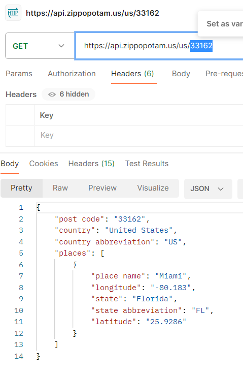

5th API (with different query) : IPinfo

Get information about a specified IP address, such as geological info, company, and carrier name.
https://ipinfo.io/165.246.116.201/geo

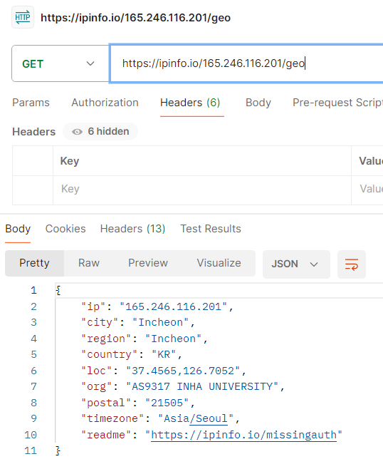

So in this part i took the same calls but changed a value to have differents datas from the first part.

Thanks again professor to understand me and give me another exercice as my VM wasnt working. You can also look through the commits i did to see the process of my work and my way of doing commits.

Valentin EYRAUD, 12235338